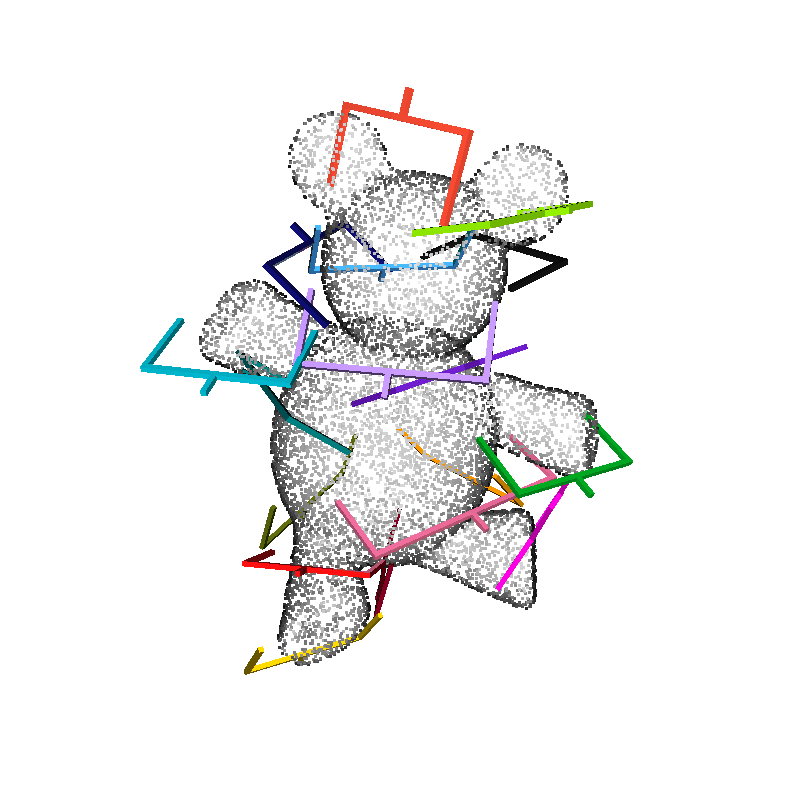
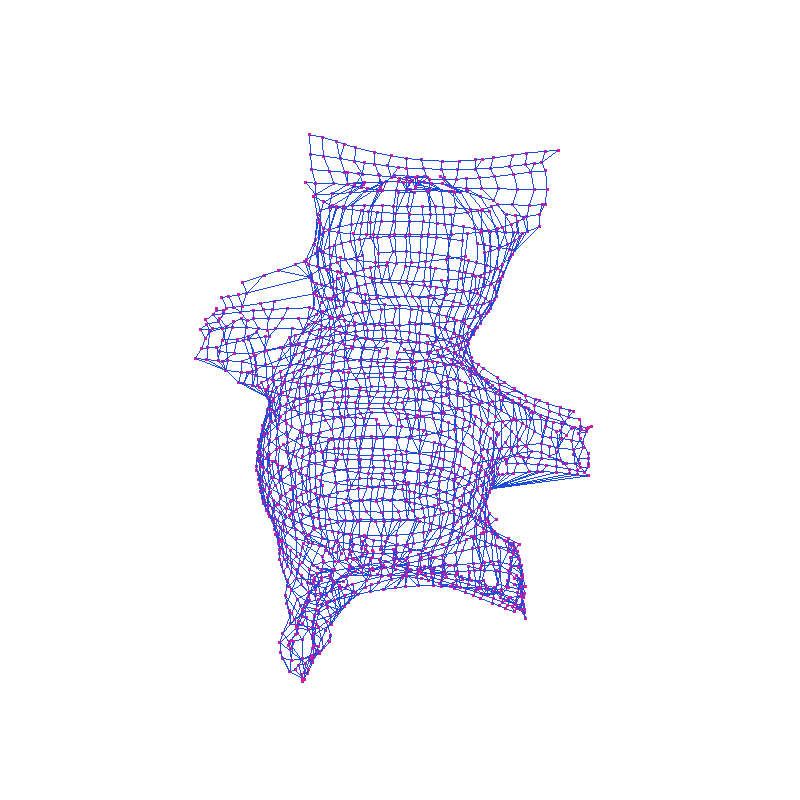
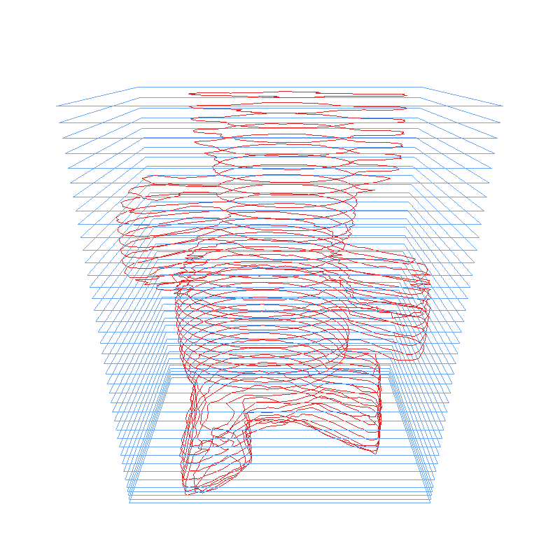
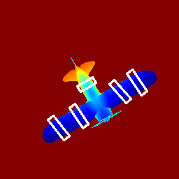
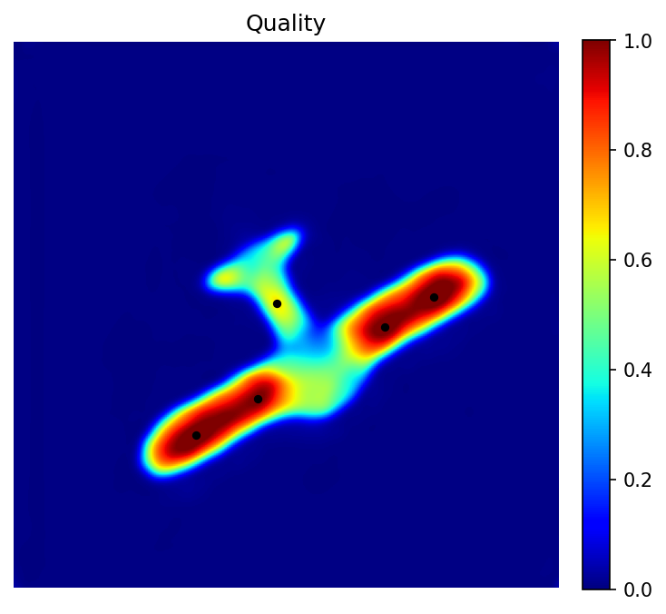
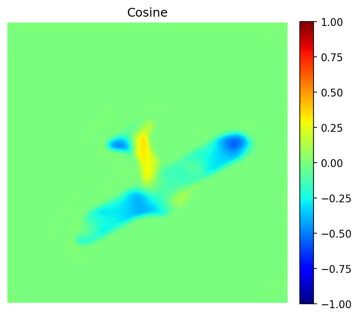
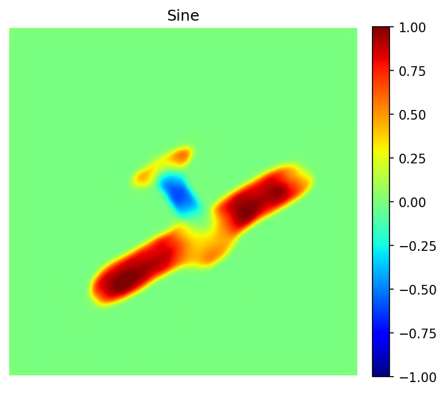
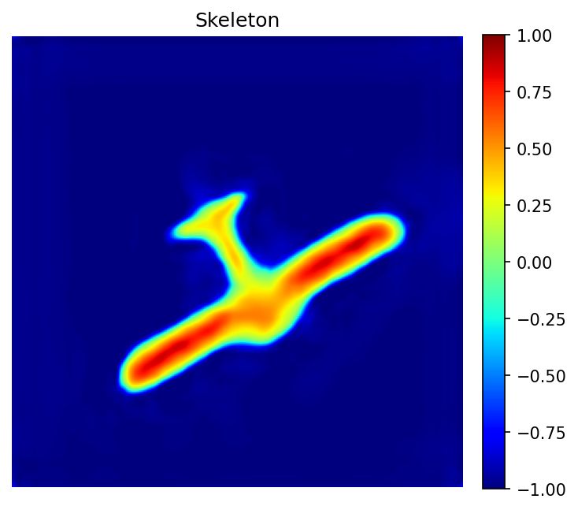

# A Geometry-Aware Grasping Framework with SkelGG-CNN

Implementation of **“Skeleton-guided geometry-aware auto-labeling for robotic grasping: From 4-DoF learning to 6-DoF execution.”**

All commands below are run from the repository root.

## 1. Dataset collection

The collector imports OBJ meshes into CoppeliaSim and captures an RGB image,
depth image, and binary object mask from each of five cameras.

### Requirements

- Conda with Python 3.9.
- CoppeliaSim with the ZeroMQ remote API available.
- The supplied scene: `data_collection/sim_collector.ttt`.

Create the environment and install the project dependencies:

```powershell
conda create -n skelenv python=3.9 -y
conda activate skelenv
conda install -c conda-forge scikit-geometry=0.1.2 "numpy=1.26.4"
pip install --extra-index-url https://download.pytorch.org/whl/cu121 -r requirements.txt
```

The requirements use the CUDA 12.1 build of PyTorch. A compatible NVIDIA
driver is required for GPU training; the remaining pipeline can still be run
on CPU.

### Input

```text
<mesh-dir>/
|-- object_1.obj
|-- object_2.obj
`-- ...
```

The collector imports each mesh, scales and positions it in the scene, and
captures views from `/cam1` through `/cam5`. The supplied scene also provides
the required `/env`, `/Spotlight`, and default-light objects.

### Run

1. Open `data_collection/sim_collector.ttt` in CoppeliaSim.
2. Leave CoppeliaSim open with the simulation stopped. The Python collector
   starts and stops the simulation for each mesh.

```powershell
python -m data_collection.dataset_collector --mesh-path <mesh-dir> --save-path <collected-data-dir>
```

Example:

```powershell
python -m data_collection.dataset_collector --mesh-path ..\meshes --save-path ..\collected_data
```

### Output format

Each mesh produces five matching samples. The mesh filename, including its
`.obj` suffix, is used as the object folder name.

```text
<collected-data-dir>/
`-- object_1.obj/
    |-- rgb/
    |   |-- 1.png
    |   `-- ... 5.png
    |-- depth/
    |   |-- 1.npy
    |   `-- ... 5.npy
    `-- mask/
        |-- 1.png
        `-- ... 5.png
```

- RGB: unsigned 8-bit PNG, shape `(H, W, 3)`.
- Depth: NumPy array, shape `(H, W, 1)`, as returned by CoppeliaSim.
- Mask: unsigned 8-bit PNG with a black object and white background.

Files belonging to one sample always share the same stem, such as `1.png`,
`1.npy`, and `1.png` in their respective folders.

## 2. 2D straight-skeleton label generation

`labeler.py` converts the collector output into grasp annotations and,
optionally, straight-skeleton gradient targets for training.

### Input format

The input is the collector directory described above. Every object folder must
contain `mask`, `rgb`, and `depth` directories. Matching files must have the
same stem and spatial resolution. Depth may be `.npy`, `.png`, `.tif`, `.tiff`,
or `.exr`; NumPy depth must have shape `(H, W)` or `(H, W, 1)`.

### Algorithm

For each binary mask, the labeler:

1. extracts and simplifies the object contour;
2. constructs its interior straight skeleton;
3. obtains grasp centers and radii from skeleton geometry;
4. pairs approximately opposing contour points;
5. applies gripper-validity and overlap filtering; and
6. converts each contact pair to center `(CX, CY)`, angle `Theta`, and opening
   width `W`.

The optional gradient target is generated from the same straight skeleton. It
is required when training with the default `--target skeleton` configuration.

### Run

Generate grasp labels and skeleton gradients:

```powershell
python labeler.py --input-dir <collected-data-dir> --output-dir <labeled-data-dir> --output-csv <labels.csv> --generate-gradient
```

Generate only the grasp labels, which is sufficient for `--target width`:

```powershell
python labeler.py --input-dir <collected-data-dir> --output-dir <labeled-data-dir> --output-csv <labels.csv>
```

Inspect one sample and save its RGB grasp-box overlay:

```powershell
python labeler.py --input-dir ..\collected_data --output-dir ..\labeler_preview --output-csv ..\labeler_preview\labels.csv --mesh object_1.obj --sample 1 --save-visualizations --generate-gradient
```

Use `--overwrite` to replace existing generated files. Without it, the labeler
stops before overwriting an existing output. `--sample` requires `--mesh`.

### Output format

```text
<labeled-data-dir>/
|-- masks/<object-name>/<sample>.png
|-- rgbs/<object-name>/<sample>.png
|-- depths/<object-name>/<sample>.npy
|-- gradients/<object-name>/<sample>_gradient.npy   # with --generate-gradient
`-- visualizations/<object-name>/<sample>.png       # with --save-visualizations
```

The annotation CSV contains:

```text
img_rgb,img_depth,gradient_name,CX1,CY1,Theta1,W1,CX2,CY2,Theta2,W2,...
```

Image and gradient fields are paths relative to `rgbs`, `depths`, and
`gradients`. Missing grasp slots are stored as empty/NaN values. This folder
and CSV can be passed directly to the training runner.

## 3. 3D straight-skeleton grasp generation

`grasp3d.py` accepts one object point cloud or one mesh and produces
collision-checked parallel-jaw grasps.

### Point-cloud input

Use a nonempty `.npy` array with shape `(N, 6)`:

```text
[x, y, z, nx, ny, nz]
```

- XYZ coordinates are in metres.
- Normals must be finite, oriented unit vectors.
- Object points used for grasp generation must lie above `Z=0`.
- The input should contain one segmented object, not an unsegmented scene.
- All supplied points remain available to collision checking.

```powershell
python grasp3d.py --point-cloud <cloud.npy> --output-dir <output-dir> --visualize
```

### Mesh input

```powershell
python grasp3d.py --mesh ..\meshes\M008434.obj --output-dir ..\grasp_preview\M008434 --visualize --orientation-seed 42
```

Mesh input defaults to gripper scale `0.1`, height `0.002 m`, and depth
`0.025 m`. Point-cloud input defaults to scale `1.0`, height `0.02 m`, and
depth `0.03 m`.

### Algorithm

The 3D pipeline:

1. voxel-downsamples the object cloud at `0.005 m`;
2. creates overlapping `0.025 m` height sections with 80% overlap;
3. contracts each section into a 3D skeleton and connects the slice graphs;
4. builds a 2D alpha-shape polygon and straight skeleton for each section;
5. scores contact pairs using their surface geometry and normals;
6. graph-refines the ten highest-scoring initial pairs; and
7. tests gripper widths and full-axis orientations for collision and empty
   grasps.

By default, orientations are tested every 15 degrees.

Useful controls include:

```text
--num-grasps N
--rotation-step-degrees DEGREES
--max-width-expansion METRES
--width-step METRES
--empty-thresh POINTS
--orientation-seed SEED
--overwrite
```

### Output format

```text
<output-dir>/
|-- contacts.npy              # (K, 2, 3) contact endpoints
|-- scores.npy                # (K,) skeleton/contact scores
|-- grasps.npy                # (K, 17) GraspNet-format grasps
|-- rejected_grasps.npy       # rejected width/orientation candidates
|-- rotation_degrees.npy      # selected rotations
|-- width_expansions.npy      # selected extra openings
|-- selected_colliding.npy    # fallback/collision flags
pose format
`-- summary.json              # input and generation metadata
```

Collision checking covers the supplied point set and gripper geometry. It does
not check a robot arm, motion trajectory, or geometry absent from the cloud.

### Example Demomnstration

The following synchronized demonstrations use the sample mesh in the repo.

| Final Grasps | 3D skeleton graph | 2D sections and polygons |
| --- | --- | --- |
|  |  |  |

These are pre-rendered algorithm views. The production CLI keeps only the
point-cloud/mesh grasp generator and its interactive Open3D visualization.

## 4. Training SkelGG-CNN

Training uses one `SkeletonGG_CNN` model, a shared trainer, and separate
Jacquard and Dex-Net path adapters. Dataset type, input modality, and fourth
prediction target are selected with command-line flags.

### Training input

```text
<data-root>/
|-- rgbs/
|   `-- image files or per-object subfolders
|-- depths/
|   `-- depth files or per-object subfolders
`-- gradients/
    `-- skeleton .npy files or per-object subfolders
```

The CSV can be stored anywhere. It must contain `img_rgb`, `img_depth`,
`gradient_name`, and at least one complete grasp group:
`CX1`, `CY1`, `Theta1`, and `W1`. Additional grasp groups use increasing
indices. Paths may be filenames for flat datasets or relative paths for nested
labeler output.


### Run training

General form:

```powershell
python -m training.run --dataset {jacquard|dexnet} --modality {rgb|depth|rgbd} --target {skeleton|width} --data-root <data-root> --train-csv <train.csv> [options]
```

Jacquard RGB training with the default skeleton target:

```powershell
python -m training.run --dataset jacquard --modality rgb --target skeleton --data-root ..\labeler0 --train-csv ..\csvs\FinalJacquardData.csv --device cuda
```

Dex-Net RGB-D training:

```powershell
python -m training.run --dataset dexnet --modality rgbd --target skeleton --data-root ..\train-dexnet --train-csv ..\csvs\train_final_cleaned.csv --device cuda
```

Width-target training:

```powershell
python -m training.run --dataset dexnet --modality depth --target width --data-root ..\train-dexnet --train-csv ..\csvs\train_final_cleaned.csv --device cuda
```

The default device is CPU. Use `--device cuda` to require CUDA or
`--device auto` to select CUDA when available. Other important options are
`--epochs`, `--batch-size`, `--learning-rate`, `--workers`, `--dropout`,
`--no-augment`, `--resume`, and `--output-dir`.


### Training output

Without `--output-dir`, results are saved to:

```text
runs/<dataset>_<modality>_<target>/
|-- best.pt
|-- last.pt
`-- history.json
```

`history.json` records train/validation metrics and learning rates.

### Visualize a trained model

Save prediction heatmaps and grasp bounding boxes on a test CSV:

```powershell
python -m training.visualize --dataset dexnet --modality depth --target skeleton --checkpoint runs\dexnet_depth_skeleton\best.pt --data-root ..\train-dexnet --test-csv ..\csvs\test_final_cleaned.csv --output-dir runs\dexnet_depth_skeleton\visualizations --threshold 0.4 --num-grasps 5 --device cuda
```

`--threshold` is the absolute local-quality threshold. Omit `--num-grasps` to
retain every local maximum above it. Use `--random-samples N` to visualize a
random subset and `--seed` for repeatable selection.

### Prediction example

The following outputs are from the first airplane sample in the saved Dex-Net
depth run. The white rectangles show the decoded grasp bounding boxes.

<p align="center">
  
</p>

| Quality | Cosine | Sine | Skeleton |
| --- | --- | --- | --- |
|  |  |  |  |

## Citation

If you find this work useful in your research, please cite our paper:

```bibtex
@article{sabzejou2026skeleton,
  title={Skeleton-guided geometry-aware auto-labeling for robotic grasping: From 4-DoF learning to 6-DoF execution},
  author={Sabzejou, A. and Azimmohseni, F. and Tale Masouleh, M. and Kalhor, A.},
  journal={The International Journal of Robotics Research},
  year={2026},
  doi={10.1177/02783649261477772},
  publisher={SAGE Publications}
}
```

**Paper:** [Skeleton-guided geometry-aware auto-labeling for robotic grasping: From 4-DoF learning to 6-DoF execution](https://doi.org/10.1177/02783649261477772)
